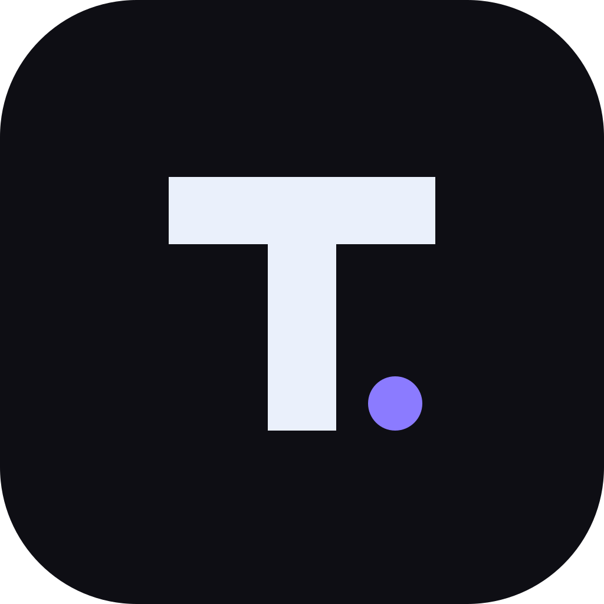
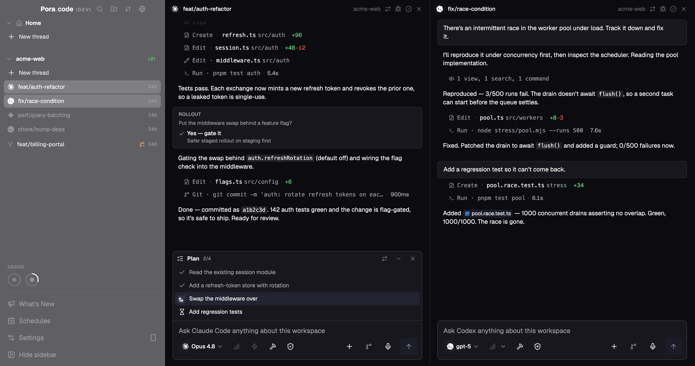

  

<h1 align="center">Lightcode</h1>

  <strong>One window for all your AI coding agents.</strong> 
  Run Claude, Codex, Gemini, Cursor, OpenCode, and Copilot side-by-side. Terminal and chat, any layout.

  <a href="https://www.lightcodeapp.com">Website</a> · <a href="https://github.com/SDSLeon/lightcode/releases">Download</a> · <a href="https://github.com/SDSLeon/lightcode/issues">Report Bug</a> · <a href="https://github.com/SDSLeon/lightcode/issues">Request Feature</a>

  <em>Bring your own agent subscriptions & API keys</em>

---

  

## Supported Agents

**Claude** · **Codex** · **Gemini** · **Cursor** · **OpenCode** · **Copilot** and any agent from the [ACP registry](https://agentclientprotocol.com).

## Why Lightcode?

If you use more than one AI coding agent, you know the pain: separate terminals, separate apps, no shared context. Lightcode puts them all in one place.

### Split & Tile

Open as many agent threads as you need and arrange them in horizontal and vertical splits. Resize, stack, and rearrange freely. The layout stays fast no matter how many threads you have running.

### Real Terminals

CLI agents run in actual PTY sessions. The same output you'd see in your own terminal, nothing reformatted or abstracted away.

### Chat UI for SDK & ACP Agents

Agents that support structured APIs (like ACP or provider SDKs) get a proper chat interface with markdown, syntax highlighting, and tool call displays.

### Save & Resume

CLI agent sessions persist to disk. Close the app, reopen it, and pick up where you left off.

### Git Review

View diffs, stage files, generate commit messages with AI, and review GitHub PRs. All built in.

### Code Editor

Monaco-based editor with LSP support for quick edits without switching to your IDE.

### Windows + WSL

Use Windows and WSL projects in the same workspace. Lightcode routes agent commands through the right environment automatically.

### ACP Registry

Install and run any agent from the [Agent Client Protocol](https://agentclientprotocol.com) registry directly from settings.

## Install

Download the latest release for your platform from the [releases page](https://github.com/SDSLeon/lightcode/releases) or visit [lightcodeapp.com](https://www.lightcodeapp.com).

| Platform | Format           |
| -------- | ---------------- |
| macOS    | DMG (Universal)  |
| Windows  | NSIS installer   |
| Linux    | AppImage, `.deb` |

### Getting Started

1. Install Lightcode for your platform.
2. Install the AI agent CLIs you want to use (e.g., [Claude Code](https://docs.anthropic.com/en/docs/claude-code), [Gemini CLI](https://github.com/google-gemini/gemini-cli), [Codex](https://github.com/openai/codex)).
3. Open Lightcode, add your project, and start orchestrating.

## Contributing

Contributions are welcome! Please open an [issue](https://github.com/SDSLeon/lightcode/issues) first to discuss what you'd like to change.

## License

[Apache-2.0](LICENSE)
